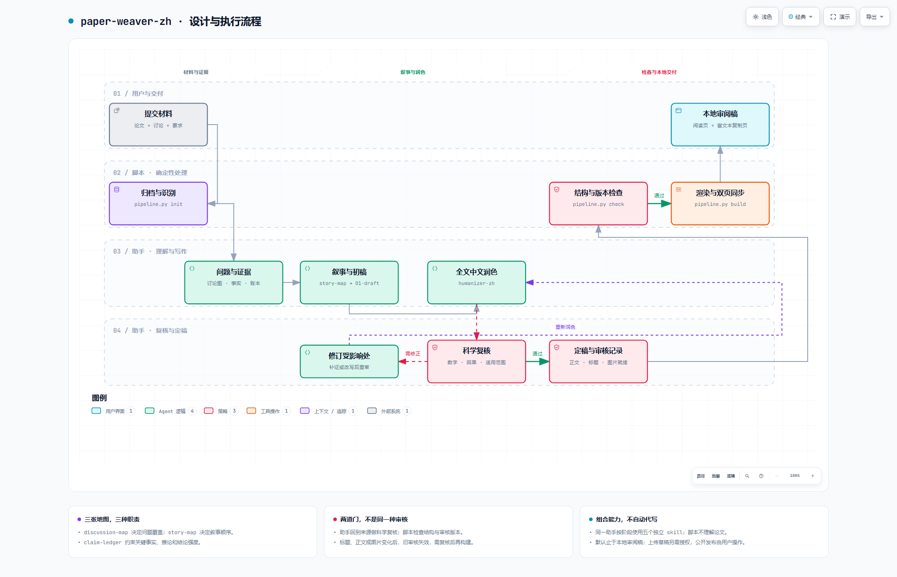

# ReoNa-paper-digest · Paper Weaver 分支

把一篇或多篇论文与研究讨论，编织成证据可追溯、中文自然的科研长文，并生成同步的阅读页与微信公众号富文本复制页。

这是基于 [ReoNa0216/ReoNa-paper-digest](https://github.com/ReoNa0216/ReoNa-paper-digest) 的个人修改分支，保留 ReoNa 工具链，加入 **paper-weaver-zh 0.1.1-fork** 组合工作流。上游代码与第三方 skill 的来源分别保留，不将它们归为本分支原创。

“一键”指助手在收到材料后连续完成工作：阅读论文、组织论证、写作、润色与科学复核由助手执行；Python 负责归档、结构检查和渲染。默认交付本地审阅稿，不自动上传微信或公开发布。

## 这个分支增加了什么

- **问题覆盖与文章顺序分开。** 讨论图整理用户真正关心的问题，叙事图安排读者理解顺序，不把聊天记录机械改成章节。
- **证据账本与三阶段稿件。** 保留事实、解释、假设和用户判断的身份，保存初稿、全文润色稿和复核稿。
- **全文中文编辑后再做科学复核。** 检查数字、单位、物种、分母、比较对象与结论强度，避免润色把“提示”改成“证明”。
- **审核绑定当前版本。** 正文、标题、摘要和图片定稿后记录指纹；受审核材料变化后要重新复核，不能仅刷新哈希。
- **同步交付两种页面。** 阅读页和富文本复制页共用相同正文内容，保留微软雅黑字体栈、紫色强调、原生上标和复制降级路径。
- **仓库内依赖可直接查找。** 不要求存在作者开发机上的全局 skill；依赖仍保持独立目录。

## 流程图

[](docs/paper-weaver.html)

[交互版 HTML](docs/paper-weaver.html) · [可编辑图源 JSON](docs/paper-weaver.workflow.json) · [设计说明](docs/design.md)

图由 [Archify](https://github.com/tt-a1i/archify) 生成。README 展示静态预览；交互版包含缩放、深浅主题等控件，请下载 `paper-weaver.html` 后在浏览器打开。GitHub 文件浏览页不是网页运行环境，不会在 README 内执行这份 HTML。图表文件是独立文档，不是运行写作流程所需的依赖。本分支不附自动部署工作流。

## 写作、润色与讨论整理：分别由谁负责

需要明确区分 **article-writing 的结构编辑** 与 **humanizer-zh 的全文中文润色**。它们不是两个同义的“去 AI 味”步骤。新增的 note-organizing 则负责前面的讨论整理。

| 能力 | 随包位置 | 作用与边界 |
|---|---|---|
| ReoNa-paper-digest | 仓库根 `SKILL.md`、`scripts/` | 科研写作规范、收料、图表、WeMD 与渲染工具链；保留本地修改 |
| note-organizing 1.1.0 | [skills/note-organizing](skills/note-organizing/SKILL.md) | 归并重复、跳跃的问题，保留讨论来源；内部笔记不是最终文章 |
| article-writing 2.0.0 | [skills/article-writing](skills/article-writing/SKILL.md) | 组织中心问题、论证、章节与过渡；不硬套商业冲突或夸大意义 |
| humanizer-zh | [skills/humanizer-zh](skills/humanizer-zh/SKILL.md) | 全文中文编辑，修复翻译腔、指代、机械句式与节奏；不删科学限定词 |
| reona-paper-digest-zh | [skills/reona-paper-digest-zh](skills/reona-paper-digest-zh/SKILL.md) | 复用独立阅读页和富文本复制页生成器 |
| paper-weaver-zh | [skills/paper-weaver-zh](skills/paper-weaver-zh/SKILL.md) | 串联上述能力，维护证据、返工与审核版本关系 |

这些 skill 没有被拼成一篇超长提示词。助手按阶段读取规则；冲突时以当前用户要求、科学事实与本组合层的适用范围为准，具体见 [依赖与执行约定](skills/paper-weaver-zh/references/integration.md)。默认中立科学书面语，不主动要求作者人设。

## 快速开始

要求 Python 3.10+；本分支在 Python 3.12 环境验证。PDF 阅读、内置 ImageGen 等助手能力由运行环境提供，仓库不会自动购买服务或联网安装 skill。

在下载或克隆后的仓库根目录运行：

```bash
python -m pip install -r requirements.txt
python -m playwright install chromium
python skills/paper-weaver-zh/scripts/pipeline.py doctor
```

`doctor` 应把 ReoNa 定位到本仓库根，其余四项依赖定位到本仓库 `skills/`。查找优先级为显式 `--skills-root`、仓库内依赖、`$CODEX_HOME/skills`。它检查文件指纹和 Python 模块，不证明浏览器可以启动，也不证明科学审核已完成。

### 交给助手执行

在支持读取本地 skill 的助手中打开本仓库，可以直接这样请求：

```text
请读取并使用本仓库 skills/paper-weaver-zh/SKILL.md。
处理我指定文件夹中的论文 PDF、补充材料和 ChatGPT 讨论，
按主题组织一篇完整科研长文，先交付本地阅读页和富文本复制页，不上传微信。
```

已经将该 skill 安装到助手的可发现目录时，也可直接调用 `$paper-weaver-zh`。仅执行 Python 命令不会自动生成文章、证据分析或科学批准。skill 的加载机制以运行产品的 [官方说明](https://learn.chatgpt.com/docs/build-skills) 为准。

### 脚本能做的事

```bash
# 归档材料；输出必须是新的或空的目录
python skills/paper-weaver-zh/scripts/pipeline.py init --out ../article-work/001-topic --paper ../inbox/main.pdf --chat ../inbox/discussion.md

# 以下步骤在助手完成分析、写作、科学复核，并定稿标题和图片之后执行
python skills/paper-weaver-zh/scripts/pipeline.py fingerprint ../article-work/001-topic
# 将指纹和真实审核结果写入 analysis/review.yaml；命令本身不批准稿件
python skills/paper-weaver-zh/scripts/pipeline.py check ../article-work/001-topic
python skills/paper-weaver-zh/scripts/pipeline.py build ../article-work/001-topic --screenshot
```

多论文使用重复 `--paper`，补充材料使用 `--supplement P002=supplement.pdf`。官方对话 JSON/ZIP 含多个对话时，用 `--title-filter` 选到唯一对话。参数完整含义见 [执行约定](skills/paper-weaver-zh/references/integration.md)。文章工作目录建议放在代码仓库之外。

## 输出与安全边界

```text
文章目录/
├── materials/               原始材料归档、来源 ID、规范化对话
├── analysis/                问题图、论文事实、证据账本、叙事图、审核记录
├── drafts/                  01-draft、02-polished、03-reviewed
├── article.md               正文唯一来源
├── meta.yaml / refs.md      元数据与参考文献
└── dist/
    ├── article.html         微信内联样式正文
    ├── reading.html         独立阅读页
    └── preview.html         同内容富文本复制页
```

结构检查通过不等于科学结论真实。未核实事实不得写成已证实结论，未做微信实际粘贴测试时不得声称已通过。

原有 `scripts/publish.py` 保留，但不是 paper-weaver 默认构建步骤。只有用户明确要求上传草稿时才进入相应流程；微信封面设置按实际工具能力处理，公开发布与群发由用户操作。请勿把 API 密钥、登录态、原始讨论、论文或生成文章提交到代码仓库。

## 测试与版本

```bash
python -m unittest discover -s skills/paper-weaver-zh/scripts/tests -v
python tests/test_publish_logic.py
python tests/test_editorial_lint.py
```

本分支基于 ReoNa 上游提交 `1062cb0496abadcc018f0025fe9522632c168c96` 及已修改的本机 0.8.0 工具链，paper-weaver 来源为 0.1.0-local。本次分发版升为 0.1.1-fork：增加仓库内路径解析，并明确标题、图片完成后才记录最终审核指纹。未将开发机已安装版本自动升级。

此前已完成 29 项基础单元测试及单论文短篇流程试跑；本次打包的实际复验结果和未测范围见 [验证记录](docs/VALIDATION.md)。这不是多论文长文质量或微信后台保存的全面验收。

## 如何放入自己的 fork 分支

见 [上传说明](docs/UPLOAD.md)。压缩包需要先解压，再将仓库根层级的文件上传到目标分支；不要只把 ZIP 本身提交为一个附件。建议分支名 `codex/paper-weaver-zh`，不会代替你创建分支或推送远端。

## 来源与许可证

ReoNa 保留原 [MIT LICENSE](LICENSE) 与作者署名；humanizer-zh 保留自己的 MIT 许可证。article-writing / note-organizing 保留原始 `SKILL.md` 中的作者与 MIT 声明。交互图的 Archify 运行时代码另附其许可证。

详细来源、修改范围与许可证边界见 [THIRD_PARTY_NOTICES.md](THIRD_PARTY_NOTICES.md) 和 [依赖指纹快照](skills/paper-weaver-zh/dependencies.lock.json)。上游使用说明另存为 [README.upstream.md](docs/README.upstream.md)，其中版本、测试与路径描述属于上游文档，不代替本分支说明。
