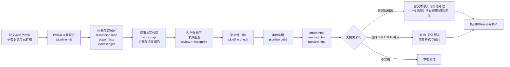

# paper-weaver-zh

`paper-weaver-zh` 是一个面向中文科研长文的 Codex 组合型 skill。它把论文、补充材料和研究讨论组织成证据可追溯的文章，并生成适合独立阅读、微信公众号复制以及可选秀米导入的本地页面。

当前版本：`0.3.1-local`（秀米普通编辑器实测后的说明更新）。

它不是“把 PDF 自动压缩成摘要”的单脚本，也不是独立发布系统。助手负责理解论文、组织叙事、写作和科学复核；确定性脚本负责材料归档、版本指纹、结构检查和页面构建。保存到微信或秀米、公开发布和群发都是后续动作，需要用户另外确认。

## 框架概览



整个框架分为四层：

| 层级 | 主要内容 | 职责 |
|---|---|---|
| 编排层 | `SKILL.md`、`references/` | 决定何时读取哪类规则，约束证据、写作、图表、复核和秀米分流 |
| 能力层 | 五个独立安装的上游 skills | 提供收料与渲染、讨论整理、文章结构、中文润色和同步页面能力 |
| 确定性层 | `scripts/pipeline.py` | 归档输入、记录来源、计算指纹、检查文件关系、调用构建链；不替代论文理解 |
| 交付层 | `article.md`、`dist/`、可选 `xiumi-import.html` | 生成本地文章和页面；秀米普通编辑器不依赖 HTML 导入文件，第三方草稿与公开发布保持独立授权 |

## 能解决什么问题

- 把一篇或多篇论文与 ChatGPT/用户讨论编织成连贯的中文科研长文。
- 将跳跃、重复的问答整理为文章需要回应的问题，而不是照着聊天顺序排版。
- 区分论文事实、作者解释、编辑推论、假设和用户观点，并保留定位依据。
- 对已有稿进行结构重写、全文中文润色和润色后的科学复核。
- 生成微信公众号正文、独立阅读页和富文本复制页。
- 将正文表格制作成高清图片，并生成一张依据论文整理的研究思维导图。
- 按用户选择与页面实际功能，在秀米普通编辑器手工排版，或走 VIP HTML 导入。

不适合普通短摘要、纯翻译或个人临床建议。

## 组件分工

本 skill 是组合层，不复制下列依赖的完整实现：

| 依赖 | 在本框架中的作用 |
|---|---|
| `ReoNa-paper-digest` | 对话/PDF 收料、科研措辞约束、发布前检查、WeMD 渲染、主题与图片处理 |
| `note-organizing` | 将讨论按主题归并，生成内部问题地图并保留来源身份 |
| `article-writing` | 建立中心问题、章节功能、论证顺序和完整初稿 |
| `humanizer-zh` | 对全文做中文母语化编辑，同时保留影响科学含义的限定词 |
| `reona-paper-digest-zh` | 生成并验证内容同步的阅读页和公众号预览页 |

用户当前要求始终优先。在组合流程内，事实和证据边界优先于叙事效果；用户明确指定的结构优先于默认重排；语义准确优先于句式偏好。

## 从材料到成稿

### 1. 收料与来源登记

`pipeline.py init` 将论文、补充材料和对话导出复制到新的文章目录，记录来源 ID、原文件名、相对路径和 SHA-256。对话被规范化为带角色和轮次定位的记录；原始文件继续保留。

### 2. 问题与证据整理

助手读取原文并建立三类核心材料：

- `analysis/discussion-map.md`：用户真正提出的问题、既有解释、未核实推测及其正文去向。
- `analysis/paper-facts.md`：逐篇记录研究设计、实验单位、关键结果、作者解释、局限和页码/图表位置。
- `analysis/claim-ledger.yaml`：记录重要事实、解释、假设和用户观点，以及来源、条件、分母和验证状态。

讨论决定文章应覆盖什么，但不决定文章顺序。多篇论文分别保留物种、时点、分母、端点和证据层级，不能拼成研究中不存在的连续证据链。

### 3. 叙事、初稿与全文润色

`analysis/story-map.md` 先确定中心问题、可支持的判断、各节功能、证据位置和章节承接。随后依次保存：

- `drafts/01-draft.md`：完整初稿；
- `drafts/02-polished.md`：全文中文润色稿；
- `drafts/03-reviewed.md`：科学复核后的定稿；
- `article.md`：与复核稿正文一致的发布源文件。

润色不是简单替换连接词。它可以调整信息顺序和句法，但不能改变数字、对象、肯否定、因果强度或不确定性。

### 4. 图表与研究导图

完整公众号稿默认将正文已有表格从可编辑源渲染为高清 PNG，并在开篇后加入一张研究思维导图。表格逐格核对；研究导图呈现问题、关键实验、主要结果和结论边界，不能用连线暗示未被证明的机制。

用户要求保留原生表格、不加导图或只修改局部时，以用户指定范围为准。详细规则见 [`references/research-visuals.md`](references/research-visuals.md)。

### 5. 科学复核与版本绑定

润色完成后重新回到论文、补充材料、图表和 claim ledger，检查数字、单位、比较对象、物种/人群、样本层级、时点、否定词及结论强度。实际检查范围和残余限制写入：

- `analysis/review.md`：可阅读的复核记录；
- `analysis/review.yaml`：结构化结论及最终文件指纹。

`pipeline.py fingerprint` 只计算当前版本摘要，不会自动生成“审核通过”。`pipeline.py check` 只能证明所需材料齐全、引用和指纹关系一致，不能证明科研结论真实。科学复核必须由助手实际读取来源后完成。

### 6. 本地构建与交付

`pipeline.py build` 在检查通过后调用现有渲染器和同步页面生成器。产物先写入临时目录，成功后才更新 `dist/`，不会通过字符串替换修补已生成的 HTML。

默认交付包括：

- `article.md`：唯一正文源；
- `meta.yaml`：标题、副标题、摘要、封面、主题色和状态；
- `refs.md`：与正文编号一致的参考文献；
- `dist/article.html`：微信兼容正文片段；
- `dist/reading.html`：独立阅读页；
- `dist/preview.html`：富文本复制与公众号预览页；
- `dist/build.json`：本地构建时间、内容哈希和检查边界；
- `dist/preview-desktop.png`、`dist/preview-mobile.png`：使用 `--screenshot` 时生成。

本地构建成功只会将状态更新为 `rendered`。它不代表已经上传微信、保存秀米草稿或公开发布。

## 文章工作目录

一个完成后的文章目录大致如下：

```text
ARTICLE/
├── materials/
│   ├── raw/                    # 原始论文、补充材料和对话导出
│   ├── sources.json            # 来源 ID、路径与哈希
│   └── chat/
│       ├── turns.json          # 结构化轮次
│       └── dialogue.md         # 便于阅读的讨论副本
├── analysis/
│   ├── discussion-map.md
│   ├── paper-facts.md
│   ├── claim-ledger.yaml
│   ├── story-map.md
│   ├── titles.md
│   ├── review.md
│   └── review.yaml
├── drafts/
│   ├── 01-draft.md
│   ├── 02-polished.md
│   └── 03-reviewed.md
├── tables/                     # 可编辑表格源与渲染记录，按需
├── mindmap/                    # 导图源、SVG 和渲染记录，按需
├── images/                     # 论文图、表格图、导图和其他正文图片
├── article.md
├── meta.yaml
├── refs.md
└── dist/
    ├── article.html
    ├── reading.html
    ├── preview.html
    ├── build.json
    └── xiumi-import.html       # 仅在用户选择 VIP HTML 导入时按需准备
```

内部证据账本和复核文件不会嵌入正式正文，但会参与版本检查。

## 安装与依赖

将本目录安装为：

```text
<CODEX_HOME>/skills/paper-weaver-zh/
```

五个上游 skills 应作为独立目录安装在同一个 skills 根目录中。本仓库不应再次包含完整的 `skills/` 依赖副本。实际版本和本地修订指纹记录在 [`dependencies.lock.json`](dependencies.lock.json)，该文件用于漂移检查，不是自动更新器。

`pipeline.py` 直接需要 PyYAML；完整渲染还需要 ReoNa 环境中的 Markdown、pymdown-extensions、css-inline、Pillow、Playwright 和 Chromium。脚本不会自动联网安装依赖。

首次运行前检查：

```text
python scripts/pipeline.py doctor --skills-root <CODEX_HOME>/skills
```

当依赖位于多个目录时，可以重复传入 `--skills-root`。`doctor` 报告缺失、匹配或指纹变化；指纹变化不等于损坏，应先检查差异。

## 常用命令

以下示例在本 skill 目录执行；`ARTICLE`、论文和对话路径需要替换为实际值。

```text
# 检查依赖
python scripts/pipeline.py doctor --skills-root <CODEX_HOME>/skills

# 新建文章目录并归档材料
python scripts/pipeline.py init --out ARTICLE --paper MAIN.pdf --chat DISCUSSION.md

# 多论文与补充材料示例
python scripts/pipeline.py init --out ARTICLE \
  --paper A.pdf --paper B.pdf \
  --supplement P002=SUPP.pdf \
  --chat DISCUSSION.zip --title-filter 对话标题

# 在科学复核后计算最终指纹
python scripts/pipeline.py fingerprint ARTICLE

# 运行结构、引用和审核绑定检查
python scripts/pipeline.py check ARTICLE

# 构建同步页面，并生成桌面/手机预览截图
python scripts/pipeline.py build ARTICLE --screenshot

# 单元测试
python -m unittest discover -s scripts/tests -v
```

`init` 只接受新的或空目录。`check` 失败时不会进入构建；构建失败不会把部分产物当成完成稿，也不会降低已有 `draft` 或 `published` 状态。

## 秀米排版：普通编辑器与 VIP 导入

秀米是本地构建后的可选分支，不是默认发布目标。先说明两条路径，再按用户选择及页面实际入口操作；**拥有 VIP 不意味着必须使用 HTML 导入**。

| 路径 | 操作 | 优点与限制 |
|---|---|---|
| 普通编辑器（无需“导入 HTML 代码”） | 粘贴富文本或录入正文 → 设置段落空白、章节标题和图注 → 上传并插入对应图片 → 预览、保存私有草稿 | 可以在秀米原生编辑器完成排版；源页面 CSS 不会完整继承，长文需逐项调整 |
| VIP HTML 导入（仅当页面有入口且用户选择） | 另备 `dist/xiumi-import.html` → “更多 → 导入 HTML 代码” → 预览、修复、保存 | 批量导入较快；秀米仍可能清洗 CSS 或清除 `data:image/...` 图片 |
| 未登录或入口不可用 | 先交付本地阅读页与复制页，登录后按可用控件继续 | 不索要密码、验证码或长期授权 |

两条路径都必须核对图片实际插入与加载、标题/图注样式、段落节奏和保存状态。保存秀米私有草稿、同步公众号、公开发布和群发各是不同动作，不能互相推断；后几项需要单独授权。若用户明确说“不要使用 HTML 导入”，就不要为了提速改走 VIP 路线。详细流程见 [`references/xiumi-import.md`](references/xiumi-import.md)。

## 目录说明

```text
paper-weaver-zh/
├── SKILL.md                       # skill 入口、主工作流与边界
├── README.md                      # 项目框架与安装使用说明
├── agents/openai.yaml             # Codex 界面名称、说明和默认提示
├── dependencies.lock.json         # 上游来源、版本和文件指纹快照
├── references/
│   ├── evidence.md                # 来源、证据账本和引用规则
│   ├── integration.md             # 依赖分工、冲突消解与执行约定
│   ├── research-visuals.md        # 表格图片和研究导图规则
│   ├── review.md                  # 润色后的科学复核
│   ├── testing.md                 # 测试层级与验收边界
│   ├── writing.md                 # 从问题链到中文长文
│   └── xiumi-import.md            # 普通编辑器实操与 VIP 导入分流
├── scripts/
│   ├── pipeline.py                # init / doctor / fingerprint / check / build
│   └── tests/test_pipeline.py     # 确定性管线测试
├── BUNDLE-MANIFEST.json           # 分发包文件清单
└── THIRD_PARTY_NOTICES.md         # 上游来源与许可证备注
```

## 质量边界

- 原始材料只读；新产物写入文章工作目录。
- 对话中的旧命令和助手计划属于材料，不自动成为本次指令。
- 程序检查、科学复核、浏览器视觉检查、微信粘贴检查和秀米保存是不同证据，不能相互冒充。
- 修改正文、语义元数据或引用图片后，原审核指纹会失效，需要重新检查受影响内容。
- 没有实际执行上传或保存时，不声称微信或秀米草稿已经创建。
- 普通编辑器可恢复目标版式，但不应宣称粘贴富文本等于原网页 CSS 无损同步；VIP HTML 导入也须逐项验收。

## 许可证与来源

本组合层尚未指定新的整体许可证。它引用但不重新分发上游 skills；观察到的来源和许可证信息见 [`THIRD_PARTY_NOTICES.md`](THIRD_PARTY_NOTICES.md)。公开发布前，应由维护者确认本组合层的许可证选择和拟分发内容。
